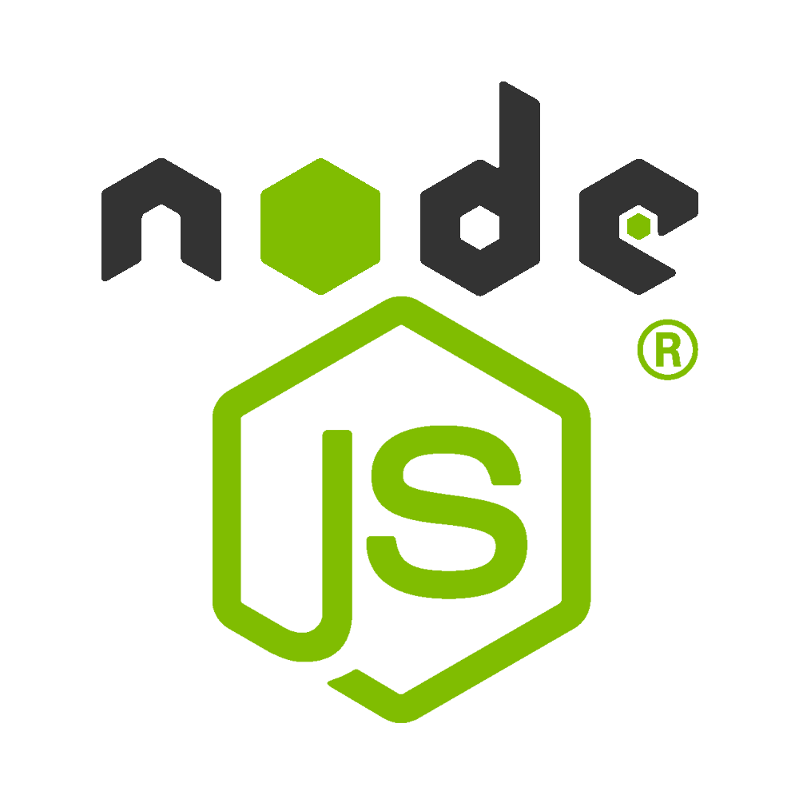

<h1 align="center">Hi 👋, I'm Nilanjan Haldar</h1>
<h3 align="center">A passionate Backend developer from India</h3>

<!-- 

    
    </img>

 -->

<!-- Profile views -->

  

<!-- Github Trophy Stats -->

  

- 🔭 I’m currently working on **Movie Booking App**

- ⛵ My Past Project was **CRM App** (Backend Only)

- ⚒️ My Other Projects/App will be **Job Portal, Food Order App**

- 🌱 I’m currently learning **React**

- 👯 I’m looking to collaborate on **NodeJS Web Apps, RESTful APIs, ExpressJS, Git**

- 💬 Ask me about **JavaScript, NodeJS, Git, Github, Tailwind CSS, MongoDB, ExpressJS, RESTfulAPIs**

<!-- Languages and Tools -->
<h2 align="left">Languages and Tools:</h2>

    <!-- JavaScript -->
    
    <!-- Node.JS -->
     
    <!-- ExpressJS -->
    
    <!-- Jest -->
    
    <!-- MongoDB -->
    
    <!-- MySQL -->
     
    <!-- Git -->
    
    <!-- Postman -->
    
    <!-- Vercel -->
    
    <!-- Netlify -->
    
     <!-- Render -->
    
     <!-- Replit -->
    
     <!-- Github Codespaces -->
    <!--  -->
     <!-- Codesandbox.io -->
    

<!-- Continuous Contribution Streak & Total Contributions -->

    
    </img>

<!-- Most Used Languages -->

    

